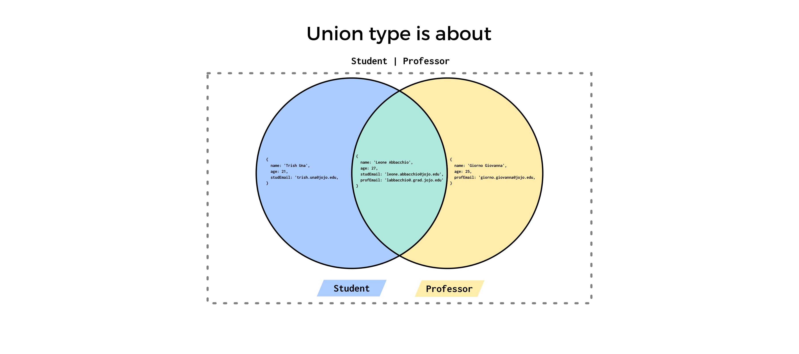
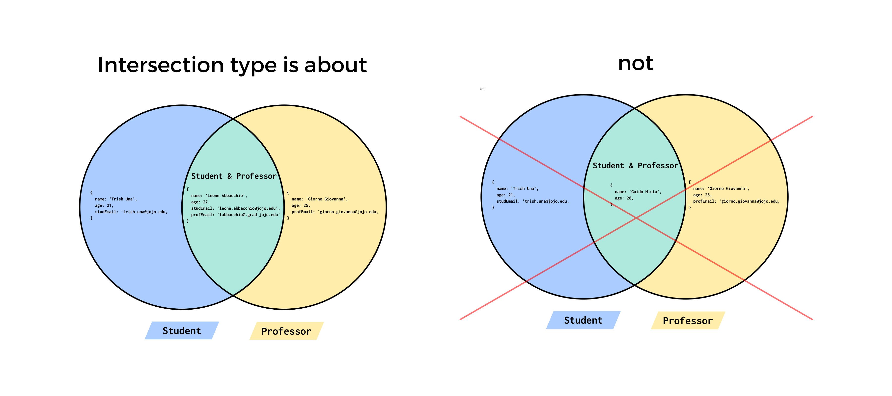

# Understanding Union and Intersection in TypeScript

Let's start by defining the following types:

```typescript
type Student = {
    name: string;
    age: number;
    studEmail: string;
};

type Professor = {
    name: string;
    age: number;
    profEmail: string;
};
```

We're now tasked with two scenarios:

1. Creating a new type `X` that allows us to assign `Student` objects,
   `Professor` objects, or objects with both the properties from `Student` and
   `Professor` to a variable of type `X`.
2. Creating a new type `X` that *only* allows objects with properties from both
   the `Student` and `Professor` types. In order words, we can only assign a
   combination of `Student` and `Professor` to it 

TypeScript’s type system allows you to build new types out of existing ones
using a large variety of operators. TypeScript defines two constructs, namely
**union types** and **intersection types**, that make this task easy.

**Note:** TypeScript is a structurally typed language, in contrast to nomative
typed languages. Thus, when we say an object of type `T` it simply means an
object with the properties/fields defined in `T`. For example, a differently
named type with the same properties as `Student` represents the same type; in
other words, the type with properties `name`, `age`, and `studEmail`:

```typescript
type UniversityStudent = {
    name: string;
    age: number;
    studEmail: string;
};

const stud: Student = {
  name: "Grahe Lutton",
  age: 23,
  studEmail: 'grahe.lutton@university.com',
};

// perfectly fine since both Student and UniversityStudent
// have the same student. The names don't matter.
const univStud: UniversityStudent = stud;
```

## Union

The TypeScript Handbook defines a **union type** as:

>a type formed from two or more other types, representing values that may be any
>one of those types. We refer to each of these types as the union’s members.

This is the similar to the definition of *set union* in Set Theory. When dealing
with types, it's clearer to think about it if we consider a **type** as a set of
values. For example, `Student` is the set of all objects with properties `name`,
`age`, and `studEmail`.

In TypeScript, you can create the union of two or more types with the `|`
operator which we typically read as *or*. In order to satisfy scenario 1 we can
create a union of type of `Student` and `Professor`:

```typescript
type StudentOrProfessor = Student | Professor;
```

Thus we read `Student | Operator` as "Student or Professor", however it's
important to keep in mind this is **inclusive or** (i.e., either or both), and
not **exclusive or** (i.e., strictly either). Knowing this, we can assign the
following objects to `StudentOrProfessor` variables:

```typescript
// student
const trish: StudentOrProfessor = {
    name: 'Trish Una',
    age: 21,
    studEmail: 'trisha.una@jojo.edu'
};

// professor
const giorno: StudentOrProfessor = {
    name: 'Giorno Giovanna',
    age: 25,
    profEmail: 'giorno.giovanna@jojo.edu'
};

// both student and professor
const leone: StudentOrProfessor = {
    name: 'Leone Abbacchio',
    age: 27,
    profEmail: 'leone.abbacchio@jojo.edu',
    studEmail: 'labbaccio@grad.jojo.edu',
};
```

It should be clear why the object representing Leone Abbacchio to `leone`, i.e.,
he's both a `Student` and a `Professor` (remember inclusive or!). Thus, we can
assign a `Student` object, a `Professor` object, or an object that's both
`Student` and `Professor` to a variable of type `StudentOrProfessor`.



## Intersection

The TypeScript Handbook defines an **intersection type** as:

>a type formed from two or more other types, representing a single value that
>combines them. 

Thus with a type intersection, unlike what the word *intersection* might imply,
we don't end up with shared properties from the intersected types but all of
their properties. The important thing to remember is that *a type intersection
isn't set intersection*, and to always use *type intersection*, instead of
simply *intersection*, in order to avoid confusing it with *set intersection*
(or simply intersection).

For a type intersection, we use `&` which we read as *and*. For scenario 2 we
define the `StudentAndProfessor` intersection type:

```typescript
type StudentAndProfessor = Student & Professor;
```

Then:

```typescript
// both student and professor
const leone: StudentAndProfessor = {
    name: 'Leone Abbacchio',
    age: 27,
    profEmail: 'leone.abbacchio@jojo.edu',
    studEmail: 'labbacchio@grad.jojo.edu',
};
```

We can only assign objects with all the properties from both `Student` and
`Professor` to variables of type `StudentAndProfessor`. Therefore the following
declarations are erroneous:

```typescript
const trish: StudentAndProfessor = {
    name: 'Trish Una',
    age: 21,
    studEmail: 'trisha.una@jojo.edu'
};

/*
Type '{ name: string; age: number; studEmail: string; }' is not assignable
to type 'StudentAndProfessor'.
Property 'profEmail' is missing in type '{ name: string; age: number; studEmail: string; }'
but required in type 'Professor'.
*/

const g: StudentAndProfessor = {
    name: 'Giorno Giovanna',
    age: 25,
    studEmail: 'giorno.giovanna@jojo.edu'
};
/*
Type '{ name: string; age: number; profEmail: string; }' is not assignable
to type 'StudentAndProfessor'.
Property 'studEmail' is missing in type '{ name: string; age: number; profEmail: string; }'
but required in type 'Student'.
*/
```



## Summary

* Union type is similar to *set union*.
* A type intersection isn't set intersection.

## Reference

* [Andrew Burgess's The KEY to unions and intersections in TypeScript](https://www.youtube.com/watch?v=EsoRUqFutYU)
* https://www.typescriptlang.org/docs/handbook/2/everyday-types.html#union-types
* https://stackoverflow.com/a/66896529/10824322


